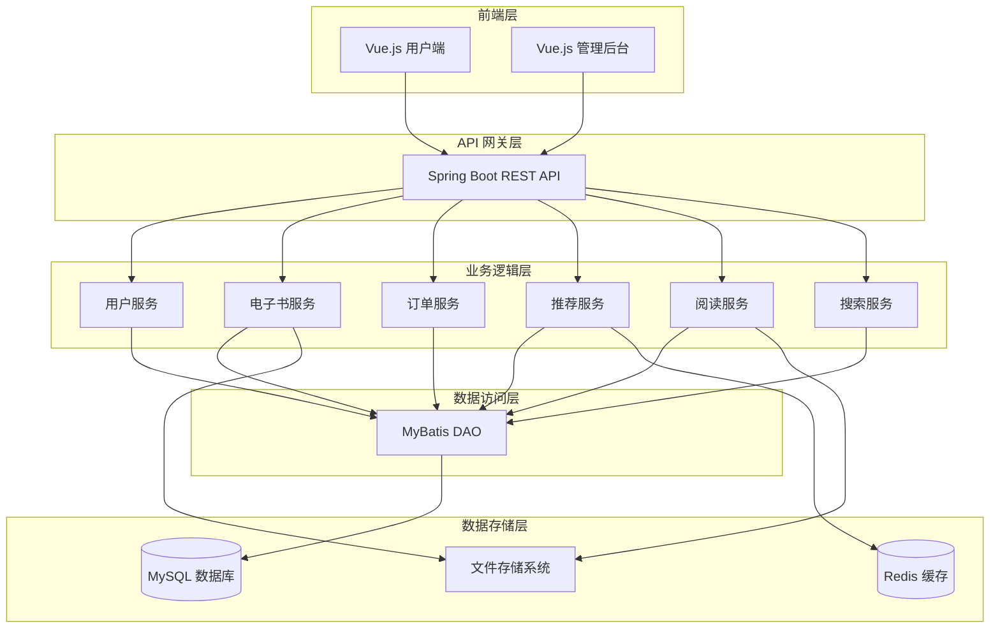
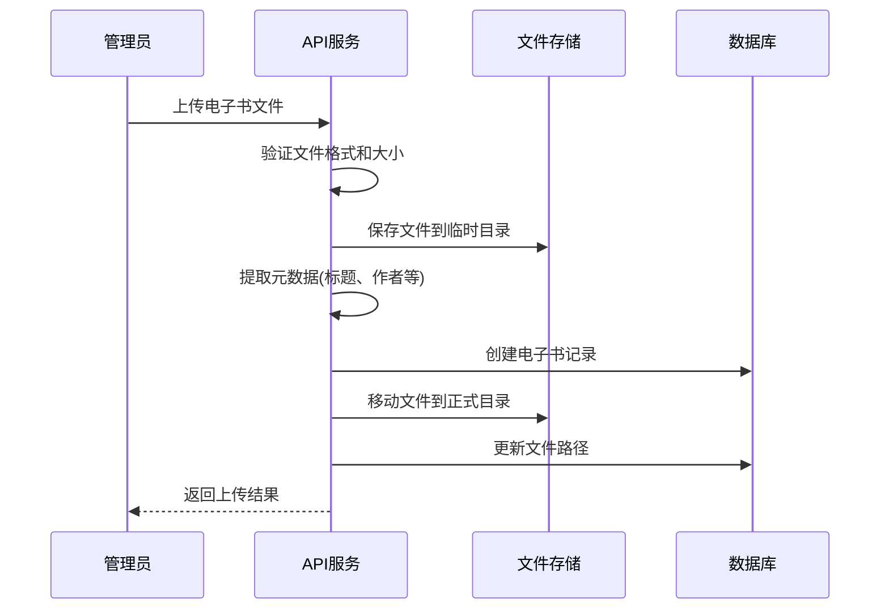
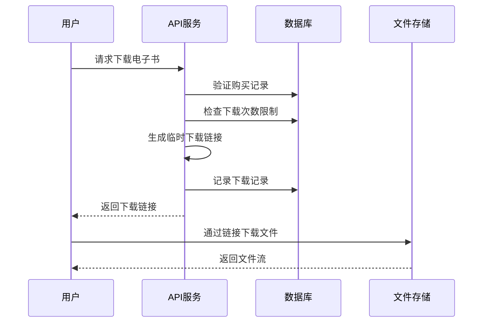

# IntelliBook-Mall 设计文档

## 概述

IntelliBook-Mall 是一个基于智能推荐的电子书商城系统，采用前后端分离架构。后端基于 Spring Boot 3.1.11 + MyBatis 构建 RESTful API，前端使用 Vue.js 开发单页应用。系统核心功能包括电子书管理、在线阅读、智能推荐、购物车、订单管理等。

本设计基于 newbee-mall 开源项目的架构进行改造，保留其成熟的用户认证、订单流程等模块，同时针对电子书业务特性进行大规模定制开发。

### 设计目标

- 支持百万级电子书库的高效管理和检索
- 提供流畅的在线阅读体验
- 实现基于用户行为的智能推荐
- 保证系统高可用性和可扩展性
- 确保电子书版权保护和安全下载

### 技术栈

**后端**:
- Spring Boot 3.1.11
- MyBatis 3.0.2
- SQLite (开发环境) / MySQL 8.0 (生产环境)
- SpringDoc (OpenAPI 3.0)
- Lombok
- JWT (用户认证)

**前端**:
- Nuxt 4 (Vue 3.5+)
- Shadcn-vue (UI 组件库)
- Tailwind CSS 4 (样式框架)
- Pinia (状态管理)
- VueUse (组合式工具集)
- Axios (HTTP 客户端)
- TypeScript (类型系统)

**第三方组件**:
- PDF.js (PDF 在线阅读)
- Epub.js (EPUB 在线阅读)
- Redis (可选，用于缓存和推荐计算)
- Radix Vue (Shadcn-vue 底层组件)

## 系统架构

### 整体架构图



### 分层架构说明

**1. 前端层 (Presentation Layer)**
- 用户端：面向普通用户的电子书浏览、购买、阅读界面
- 管理后台：面向管理员的电子书管理、订单管理、数据统计界面

**2. API 网关层 (API Gateway Layer)**
- 统一的 RESTful API 接口
- 请求路由和负载均衡
- 身份认证和权限校验
- 统一异常处理和响应格式

**3. 业务逻辑层 (Business Logic Layer)**
- 用户服务：注册、登录、个人信息管理
- 电子书服务：电子书 CRUD、元数据管理、分类管理
- 订单服务：购物车、订单创建、支付处理
- 推荐服务：基于用户行为和内容的推荐算法
- 阅读服务：在线阅读、下载管理、阅读进度记录
- 搜索服务：多条件搜索、全文检索

**4. 数据访问层 (Data Access Layer)**
- MyBatis Mapper 接口
- SQL 映射文件
- 数据库连接池管理

**5. 数据存储层 (Data Storage Layer)**
- MySQL：存储结构化数据（用户、订单、电子书元数据等）
- 文件系统：存储电子书文件、封面图片
- Redis：缓存热点数据、推荐结果

### 与 newbee-mall 架构对比

| 层次 | newbee-mall | IntelliBook-Mall | 变化说明 |
|------|-------------|------------------|----------|
| 前端层 | Vue.js 商城 + 管理后台 | Nuxt 4 电子书商城 + 管理后台 | 全面升级到 Nuxt 4 |
| API 层 | Spring Boot REST API | Spring Boot REST API | 保持一致 |
| 业务层 | 商品、订单、用户服务 | 电子书、订单、用户、推荐、阅读服务 | 新增推荐和阅读服务 |
| 数据层 | MyBatis + MySQL | MyBatis + SQLite/MySQL + Redis | 新增 Redis，支持 SQLite |
| 存储层 | 本地文件存储 | 本地/云文件存储 | 增强文件管理 |

## 前端架构设计

### Nuxt 4 应用架构

IntelliBook-Mall 前端采用 Nuxt 4 框架，提供现代化的开发体验和优秀的性能表现。

#### 核心特性

**1. 服务端渲染 (SSR)**
- 首屏快速加载
- SEO 友好
- 更好的用户体验

**2. 文件系统路由**
- 基于 `pages/` 目录自动生成路由
- 支持动态路由和嵌套路由
- 路由中间件支持

**3. 自动导入**
- 组件自动导入
- Composables 自动导入
- 工具函数自动导入

**4. TypeScript 支持**
- 完整的类型推导
- 类型安全的 API 调用
- 更好的开发体验

### 前端目录结构

```
app/
├── assets/                    # 静态资源
│   ├── css/
│   │   └── main.css          # 全局样式
│   ├── fonts/                # 字体文件
│   └── images/               # 图片资源
├── components/               # 组件目录
│   ├── cart/                 # 购物车组件
│   ├── common/               # 通用组件
│   ├── ebook/                # 电子书组件
│   ├── order/                # 订单组件
│   ├── reader/               # 阅读器组件
│   ├── recommendation/       # 推荐组件
│   └── user/                 # 用户组件
├── composables/              # 组合式函数
│   ├── useAuth.ts           # 认证逻辑
│   ├── useEBookApi.ts       # 电子书 API
│   ├── useCartApi.ts        # 购物车 API
│   ├── useOrderApi.ts       # 订单 API
│   ├── useReviewApi.ts      # 评价 API
│   └── useFavoriteApi.ts    # 收藏 API
├── layouts/                  # 布局组件
│   ├── default.vue          # 默认布局
│   └── auth.vue             # 认证页面布局
├── middleware/               # 路由中间件
│   └── auth.ts              # 认证中间件
├── pages/                    # 页面组件
│   ├── index.vue            # 首页
│   ├── auth/                # 认证页面
│   │   ├── login.vue
│   │   └── register.vue
│   ├── ebooks/              # 电子书页面
│   │   ├── [id].vue         # 电子书详情
│   │   └── index.vue        # 电子书列表
│   ├── categories/          # 分类页面
│   ├── orders/              # 订单页面
│   ├── reading/             # 阅读页面
│   │   └── [id].vue
│   └── user/                # 用户中心
│       ├── profile.vue
│       ├── favorites.vue
│       └── library.vue
├── plugins/                  # 插件
│   ├── api.client.ts        # API 客户端
│   └── error-handler.client.ts  # 错误处理
├── stores/                   # Pinia 状态管理
│   ├── auth.ts              # 认证状态
│   ├── cart.ts              # 购物车状态
│   └── reading.ts           # 阅读状态
├── types/                    # TypeScript 类型定义
│   ├── user.ts
│   ├── ebook.ts
│   ├── order.ts
│   └── api.ts
├── utils/                    # 工具函数
│   ├── format.ts            # 格式化工具
│   └── validation.ts        # 验证工具
└── app.vue                   # 根组件
```

### 状态管理架构

使用 Pinia 进行状态管理，按模块划分：

**认证状态 (auth.ts)**
```typescript
export const useAuthStore = defineStore('auth', {
  state: () => ({
    token: '',
    user: null as User | null,
    isLoading: false
  }),
  
  getters: {
    isAuthenticated: (state) => !!state.token && !!state.user
  },
  
  actions: {
    async login(credentials: LoginForm) { },
    async register(data: RegisterForm) { },
    async logout() { },
    async fetchUserInfo() { }
  },
  
  persist: {
    storage: persistedState.localStorage,
    paths: ['token', 'user']
  }
})
```

**购物车状态 (cart.ts)**
```typescript
export const useCartStore = defineStore('cart', {
  state: () => ({
    items: [] as CartItem[],
    isLoading: false
  }),
  
  getters: {
    totalPrice: (state) => state.items.reduce((sum, item) => sum + item.sellingPrice, 0),
    itemCount: (state) => state.items.length
  },
  
  actions: {
    async fetchCart() { },
    async addToCart(bookId: number) { },
    async removeFromCart(bookId: number) { },
    async clearCart() { }
  }
})
```

### API 集成架构

**API 客户端配置**

使用 Axios 创建统一的 API 客户端，通过 Nuxt 插件注入：

```typescript
// plugins/api.client.ts
export default defineNuxtPlugin(() => {
  const config = useRuntimeConfig()
  const authStore = useAuthStore()

  const api = axios.create({
    baseURL: config.public.apiBase,
    timeout: config.public.apiTimeout
  })

  // 请求拦截器 - 添加 Token
  api.interceptors.request.use((config) => {
    if (authStore.token) {
      config.headers.Authorization = `Bearer ${authStore.token}`
    }
    return config
  })

  // 响应拦截器 - 统一处理响应
  api.interceptors.response.use(
    (response) => {
      const data = response.data
      if (data.resultCode === 200) {
        return data.data
      }
      throw new Error(data.message || '请求失败')
    },
    (error) => {
      // 错误处理逻辑
      if (error.response?.status === 401) {
        authStore.clearAuth()
        navigateTo('/auth/login')
      }
      throw error
    }
  )

  return {
    provide: { api }
  }
})
```

**Composables 模式**

使用 Composables 封装 API 调用逻辑：

```typescript
// composables/useEBookApi.ts
export const useEBookApi = () => {
  const { $api } = useNuxtApp()
  
  return {
    getEBooks: (params: EBookSearchParam) =>
      $api.get('/api/ebooks/list', { params }),
    
    getEBookDetail: (id: number) =>
      $api.get(`/api/ebooks/${id}`),
    
    searchEBooks: (params: EBookSearchParam) =>
      $api.get('/api/ebooks/search', { params })
  }
}
```

### UI 组件架构

**Shadcn-vue 组件系统**

使用 Shadcn-vue 提供的可复用组件：

- Button, Input, Select 等基础组件
- Dialog, Sheet, Popover 等交互组件
- Card, Badge, Avatar 等展示组件
- Form, Table, Pagination 等复杂组件

**自定义组件**

基于 Shadcn-vue 构建业务组件：

```vue
<!-- components/ebook/EBookCard.vue -->
<template>
  <Card class="hover:shadow-lg transition-shadow">
    <CardHeader>
      
    </CardHeader>
    <CardContent>
      <h3 class="font-semibold text-lg">{{ book.bookTitle }}</h3>
      <p class="text-sm text-muted-foreground">{{ book.author }}</p>
      <div class="flex items-center justify-between mt-4">
        <span class="text-lg font-bold text-primary">¥{{ formatPrice(book.sellingPrice) }}</span>
        <Button @click="addToCart">加入购物车</Button>
      </div>
    </CardContent>
  </Card>
</template>
```

### 路由与导航

**文件系统路由**

Nuxt 4 自动根据 `pages/` 目录生成路由：

```
pages/
├── index.vue                 → /
├── auth/
│   ├── login.vue            → /auth/login
│   └── register.vue         → /auth/register
├── ebooks/
│   ├── index.vue            → /ebooks
│   └── [id].vue             → /ebooks/:id
└── user/
    ├── profile.vue          → /user/profile
    └── favorites.vue        → /user/favorites
```

**路由中间件**

实现认证保护：

```typescript
// middleware/auth.ts
export default defineNuxtRouteMiddleware((to) => {
  const authStore = useAuthStore()
  
  if (!authStore.isAuthenticated) {
    return navigateTo({
      path: '/auth/login',
      query: { redirect: to.fullPath }
    })
  }
})
```

使用中间件：

```vue
<script setup lang="ts">
definePageMeta({
  middleware: ['auth']
})
</script>
```

### 样式系统

**Tailwind CSS 4 配置**

```typescript
// nuxt.config.ts
export default defineNuxtConfig({
  css: ['~/assets/css/main.css'],
  
  postcss: {
    plugins: {
      '@tailwindcss/postcss': {}
    }
  }
})
```

**主题配置**

```css
/* assets/css/main.css */
@import "tailwindcss";

@theme {
  --color-primary: #3b82f6;
  --color-secondary: #8b5cf6;
  --radius: 0.5rem;
}
```

### 性能优化

**1. 代码分割**
- 路由级别的代码分割
- 组件懒加载
- 动态导入

**2. 图片优化**
- 使用 Nuxt Image 模块
- 自动图片优化
- 懒加载和占位符

**3. 缓存策略**
- API 响应缓存
- 静态资源缓存
- 服务端渲染缓存

**4. 预加载**
- 关键资源预加载
- 路由预取
- 数据预取


## 核心组件和接口

### 1. 用户模块 (User Module)

#### 1.1 实体设计

**MallUser (用户实体)**
```java
@Data
public class MallUser {
    private Long userId;              // 用户ID
    private String loginName;         // 登录名
    private String nickName;          // 昵称
    private String email;             // 邮箱 (新增)
    private String passwordMd5;       // MD5加密密码
    private String introduceSign;     // 个性签名
    private Byte isDeleted;           // 删除标识
    private Byte lockedFlag;          // 锁定标识
    private Integer loginFailCount;   // 登录失败次数 (新增)
    private Date lockTime;            // 锁定时间 (新增)
    private Date createTime;          // 创建时间
    private Date updateTime;          // 更新时间
}
```

**对比 newbee-mall**: 
- 新增：email、loginFailCount、lockTime、updateTime 字段
- 保留：其他所有字段

#### 1.2 服务接口

**MallUserService**
```java
public interface MallUserService {
    // 保留自 newbee-mall
    String register(String loginName, String password);
    String login(String loginName, String password);
    Boolean updateUserInfo(MallUser user);
    MallUser getUserById(Long userId);
    
    // 新增方法
    Boolean sendEmailVerification(String email);
    Boolean verifyEmail(String email, String code);
    Boolean checkLoginFailure(String loginName);
    void resetLoginFailCount(String loginName);
}
```

### 2. 电子书模块 (EBook Module)

#### 2.1 实体设计

**EBook (电子书实体)**
```java
@Data
public class EBook {
    private Long bookId;              // 书籍ID
    private String bookTitle;         // 书名
    private String author;            // 作者
    private String isbn;              // ISBN (新增)
    private String publisher;         // 出版社 (新增)
    private Date publishDate;         // 出版日期 (新增)
    private String bookIntro;         // 简介
    private Long categoryId;          // 分类ID
    private String coverImg;          // 封面图片
    private String fileFormat;        // 文件格式 (PDF/EPUB/MOBI) (新增)
    private String filePath;          // 文件路径 (新增)
    private Long fileSize;            // 文件大小(字节) (新增)
    private Integer pageCount;        // 页数 (新增)
    private Integer originalPrice;    // 原价(分)
    private Integer sellingPrice;     // 售价(分)
    private String tags;              // 标签(逗号分隔) (新增)
    private Double avgRating;         // 平均评分 (新增)
    private Integer ratingCount;      // 评分人数 (新增)
    private Byte sellStatus;          // 上架状态
    private Byte isDeleted;           // 删除标识
    private Integer createUser;       // 创建者
    private Date createTime;          // 创建时间
    private Integer updateUser;       // 更新者
    private Date updateTime;          // 更新时间
    private String detailContent;     // 详情内容
}
```

**对比 newbee-mall 的 NewBeeMallGoods**:
- 删除：stockNum (库存)、goodsCarousel (轮播图)
- 新增：isbn、publisher、publishDate、fileFormat、filePath、fileSize、pageCount、tags、avgRating、ratingCount
- 重命名：goodsId → bookId, goodsName → bookTitle 等


**EBookTag (电子书标签实体)** - 新增
```java
@Data
public class EBookTag {
    private Long tagId;               // 标签ID
    private String tagName;           // 标签名称
    private Integer useCount;         // 使用次数
    private Date createTime;          // 创建时间
}
```

**EBookTagRelation (电子书-标签关联表)** - 新增
```java
@Data
public class EBookTagRelation {
    private Long relationId;          // 关联ID
    private Long bookId;              // 书籍ID
    private Long tagId;               // 标签ID
    private Date createTime;          // 创建时间
}
```

#### 2.2 服务接口

**EBookService**
```java
public interface EBookService {
    // 基础 CRUD (改造自 newbee-mall)
    PageResult<EBook> getEBookPage(PageQueryUtil pageUtil);
    String saveEBook(EBook ebook);
    String updateEBook(EBook ebook);
    Boolean batchUpdateSellStatus(Long[] ids, int sellStatus);
    EBook getEBookById(Long id);
    
    // 新增方法
    String uploadEBookFile(MultipartFile file, Long bookId);
    Boolean batchImportEBooks(List<EBook> ebooks);
    List<EBook> getEBooksByIsbn(String isbn);
    List<EBook> getEBooksByAuthor(String author);
    Boolean addTagToEBook(Long bookId, Long tagId);
    Boolean removeTagFromEBook(Long bookId, Long tagId);
    List<EBookTag> getEBookTags(Long bookId);
    
    // 搜索相关 (增强自 newbee-mall)
    PageResult<EBook> searchEBooks(EBookSearchParam searchParam);
    PageResult<EBook> advancedSearch(AdvancedSearchParam param);
}
```

**EBookSearchParam (搜索参数)** - 新增
```java
@Data
public class EBookSearchParam {
    private String keyword;           // 关键词
    private String author;            // 作者
    private String isbn;              // ISBN
    private Long categoryId;          // 分类ID
    private List<Long> tagIds;        // 标签ID列表
    private Integer minPrice;         // 最低价格
    private Integer maxPrice;         // 最高价格
    private Integer startYear;        // 起始年份
    private Integer endYear;          // 结束年份
    private String sortBy;            // 排序字段
    private String sortOrder;         // 排序方向
    private Integer pageNumber;       // 页码
    private Integer pageSize;         // 每页数量
}
```

### 3. 订单模块 (Order Module)

#### 3.1 实体设计

**EBookOrder (电子书订单实体)**
```java
@Data
public class EBookOrder {
    private Long orderId;             // 订单ID
    private String orderNo;           // 订单号
    private Long userId;              // 用户ID
    private Integer totalPrice;       // 总价(分)
    private Byte payStatus;           // 支付状态
    private Byte payType;             // 支付方式
    private Date payTime;             // 支付时间
    private Byte orderStatus;         // 订单状态
    private String extraInfo;         // 额外信息
    private Byte isDeleted;           // 删除标识
    private Date createTime;          // 创建时间
    private Date updateTime;          // 更新时间
}
```

**对比 newbee-mall 的 NewBeeMallOrder**:
- 删除：无（订单主表结构基本保持一致）
- 说明：由于电子书无需物流，订单地址表可以删除

**EBookOrderItem (订单项实体)**
```java
@Data
public class EBookOrderItem {
    private Long orderItemId;         // 订单项ID
    private Long orderId;             // 订单ID
    private Long bookId;              // 书籍ID
    private String bookTitle;         // 书名
    private String bookCover;         // 封面
    private Integer sellingPrice;     // 售价(分)
    private Date createTime;          // 创建时间
}
```

**对比 newbee-mall 的 NewBeeMallOrderItem**:
- 删除：goodsCount (数量字段，电子书无需数量)


#### 3.2 服务接口

**EBookOrderService**
```java
public interface EBookOrderService {
    // 保留自 newbee-mall
    EBookOrderDetailVO getOrderDetailByOrderId(Long orderId);
    EBookOrderDetailVO getOrderDetailByOrderNo(String orderNo, Long userId);
    PageResult<EBookOrder> getMyOrders(PageQueryUtil pageUtil);
    String cancelOrder(String orderNo, Long userId);
    String paySuccess(String orderNo, int payType);
    String saveOrder(MallUser user, List<EBookShoppingCartItemVO> items);
    
    // 修改自 newbee-mall (移除物流相关)
    PageResult<EBookOrder> getEBookOrdersPage(PageQueryUtil pageUtil);
    String updateOrderInfo(EBookOrder order);
    String closeOrder(Long[] ids);
    
    // 删除自 newbee-mall
    // String finishOrder() - 电子书无需确认收货
    // String checkDone() - 电子书无需配货
    // String checkOut() - 电子书无需出库
    
    // 新增方法
    Boolean grantEBookAccess(Long orderId);  // 授予电子书访问权限
    List<EBook> getPurchasedEBooks(Long userId);  // 获取已购买的电子书
}
```

### 4. 购物车模块 (Shopping Cart Module)

#### 4.1 实体设计

**EBookShoppingCartItem (购物车项实体)**
```java
@Data
public class EBookShoppingCartItem {
    private Long cartItemId;          // 购物车项ID
    private Long userId;              // 用户ID
    private Long bookId;              // 书籍ID
    private Byte isDeleted;           // 删除标识
    private Date createTime;          // 创建时间
    private Date updateTime;          // 更新时间
}
```

**对比 newbee-mall 的 NewBeeMallShoppingCartItem**:
- 删除：goodsCount (数量字段，电子书无需数量)

#### 4.2 服务接口

**EBookShoppingCartService**
```java
public interface EBookShoppingCartService {
    // 保留自 newbee-mall
    String saveEBookCartItem(EBookShoppingCartItem cartItem);
    Boolean deleteCartItem(Long cartItemId, Long userId);
    List<EBookShoppingCartItemVO> getMyShoppingCartItems(Long userId);
    
    // 删除自 newbee-mall
    // updateCartItem() - 电子书无需修改数量
    
    // 新增方法
    Boolean checkIfPurchased(Long userId, Long bookId);  // 检查是否已购买
}
```

### 5. 阅读模块 (Reading Module) - 全新模块

#### 5.1 实体设计

**ReadingProgress (阅读进度实体)** - 新增
```java
@Data
public class ReadingProgress {
    private Long progressId;          // 进度ID
    private Long userId;              // 用户ID
    private Long bookId;              // 书籍ID
    private Integer currentPage;      // 当前页码
    private Double progressPercent;   // 进度百分比
    private String lastPosition;      // 最后位置(JSON格式)
    private Date lastReadTime;        // 最后阅读时间
    private Date createTime;          // 创建时间
    private Date updateTime;          // 更新时间
}
```

**DownloadRecord (下载记录实体)** - 新增
```java
@Data
public class DownloadRecord {
    private Long recordId;            // 记录ID
    private Long userId;              // 用户ID
    private Long bookId;              // 书籍ID
    private String downloadUrl;       // 下载链接
    private Date expireTime;          // 过期时间
    private Integer downloadCount;    // 下载次数
    private Date createTime;          // 创建时间
}
```

#### 5.2 服务接口

**ReadingService** - 新增
```java
public interface ReadingService {
    // 阅读进度管理
    Boolean saveReadingProgress(ReadingProgress progress);
    ReadingProgress getReadingProgress(Long userId, Long bookId);
    List<ReadingProgress> getRecentReadingBooks(Long userId, Integer limit);
    
    // 在线阅读
    String getEBookContent(Long userId, Long bookId);
    Boolean verifyReadingPermission(Long userId, Long bookId);
    
    // 下载管理
    String generateDownloadUrl(Long userId, Long bookId);
    Boolean verifyDownloadPermission(Long userId, Long bookId);
    DownloadRecord getDownloadRecord(Long userId, Long bookId);
    Boolean incrementDownloadCount(Long recordId);
}
```


### 6. 推荐模块 (Recommendation Module) - 全新模块

#### 6.1 实体设计

**UserBehavior (用户行为实体)** - 新增
```java
@Data
public class UserBehavior {
    private Long behaviorId;          // 行为ID
    private Long userId;              // 用户ID
    private Long bookId;              // 书籍ID
    private String behaviorType;      // 行为类型(VIEW/SEARCH/PURCHASE/FAVORITE)
    private String behaviorData;      // 行为数据(JSON格式)
    private Date createTime;          // 创建时间
}
```

**RecommendationCache (推荐缓存实体)** - 新增
```java
@Data
public class RecommendationCache {
    private Long cacheId;             // 缓存ID
    private Long userId;              // 用户ID
    private String recommendType;     // 推荐类型(PERSONAL/HOT/SIMILAR)
    private String bookIds;           // 书籍ID列表(逗号分隔)
    private Date expireTime;          // 过期时间
    private Date createTime;          // 创建时间
}
```

#### 6.2 服务接口

**RecommendationService** - 新增
```java
public interface RecommendationService {
    // 用户行为追踪
    Boolean trackUserBehavior(UserBehavior behavior);
    List<UserBehavior> getUserBehaviorHistory(Long userId, String behaviorType);
    
    // 推荐算法
    List<EBook> getPersonalRecommendations(Long userId, Integer limit);
    List<EBook> getSimilarBooks(Long bookId, Integer limit);
    List<EBook> getHotBooks(Integer limit);
    List<EBook> getCategoryRecommendations(Long categoryId, Integer limit);
    
    // 推荐缓存管理
    Boolean cacheRecommendations(Long userId, String type, List<Long> bookIds);
    List<Long> getCachedRecommendations(Long userId, String type);
    Boolean clearRecommendationCache(Long userId);
}
```

### 7. 评价模块 (Review Module) - 全新模块

#### 7.1 实体设计

**EBookReview (电子书评价实体)** - 新增
```java
@Data
public class EBookReview {
    private Long reviewId;            // 评价ID
    private Long userId;              // 用户ID
    private Long bookId;              // 书籍ID
    private Integer rating;           // 评分(1-5)
    private String reviewContent;     // 评价内容
    private Integer likeCount;        // 点赞数
    private Byte isDeleted;           // 删除标识
    private Date createTime;          // 创建时间
    private Date updateTime;          // 更新时间
}
```

**ReviewLike (评价点赞实体)** - 新增
```java
@Data
public class ReviewLike {
    private Long likeId;              // 点赞ID
    private Long userId;              // 用户ID
    private Long reviewId;            // 评价ID
    private Date createTime;          // 创建时间
}
```

#### 7.2 服务接口

**EBookReviewService** - 新增
```java
public interface EBookReviewService {
    // 评价管理
    String saveReview(EBookReview review);
    Boolean updateReview(EBookReview review);
    Boolean deleteReview(Long reviewId, Long userId);
    PageResult<EBookReview> getBookReviews(Long bookId, PageQueryUtil pageUtil);
    
    // 评分统计
    Double calculateAvgRating(Long bookId);
    Boolean updateBookRating(Long bookId);
    
    // 点赞管理
    Boolean likeReview(Long userId, Long reviewId);
    Boolean unlikeReview(Long userId, Long reviewId);
    Boolean checkIfLiked(Long userId, Long reviewId);
    
    // 权限验证
    Boolean verifyReviewPermission(Long userId, Long bookId);
}
```

### 8. 收藏模块 (Favorite Module) - 全新模块

#### 8.1 实体设计

**EBookFavorite (电子书收藏实体)** - 新增
```java
@Data
public class EBookFavorite {
    private Long favoriteId;          // 收藏ID
    private Long userId;              // 用户ID
    private Long bookId;              // 书籍ID
    private Date createTime;          // 创建时间
}
```

#### 8.2 服务接口

**EBookFavoriteService** - 新增
```java
public interface EBookFavoriteService {
    Boolean addFavorite(Long userId, Long bookId);
    Boolean removeFavorite(Long userId, Long bookId);
    Boolean checkIfFavorited(Long userId, Long bookId);
    PageResult<EBook> getMyFavorites(Long userId, PageQueryUtil pageUtil);
    Integer getFavoriteCount(Long bookId);
}
```


## 数据模型

### 数据库 ER 图


### 核心表结构设计

#### 1. tb_ebook (电子书表)

```sql
CREATE TABLE `tb_ebook` (
  `book_id` bigint(20) NOT NULL AUTO_INCREMENT COMMENT '书籍ID',
  `book_title` varchar(200) NOT NULL COMMENT '书名',
  `author` varchar(100) NOT NULL COMMENT '作者',
  `isbn` varchar(20) DEFAULT NULL COMMENT 'ISBN',
  `publisher` varchar(100) DEFAULT NULL COMMENT '出版社',
  `publish_date` date DEFAULT NULL COMMENT '出版日期',
  `book_intro` varchar(500) DEFAULT '' COMMENT '简介',
  `category_id` bigint(20) NOT NULL COMMENT '分类ID',
  `cover_img` varchar(200) NOT NULL COMMENT '封面图片',
  `file_format` varchar(10) NOT NULL COMMENT '文件格式(PDF/EPUB/MOBI)',
  `file_path` varchar(500) NOT NULL COMMENT '文件路径',
  `file_size` bigint(20) NOT NULL COMMENT '文件大小(字节)',
  `page_count` int(11) DEFAULT 0 COMMENT '页数',
  `original_price` int(11) NOT NULL DEFAULT 0 COMMENT '原价(分)',
  `selling_price` int(11) NOT NULL DEFAULT 0 COMMENT '售价(分)',
  `tags` varchar(200) DEFAULT '' COMMENT '标签(逗号分隔)',
  `avg_rating` decimal(3,2) DEFAULT 0.00 COMMENT '平均评分',
  `rating_count` int(11) DEFAULT 0 COMMENT '评分人数',
  `sell_status` tinyint(4) NOT NULL DEFAULT 0 COMMENT '上架状态(0-上架 1-下架)',
  `is_deleted` tinyint(4) NOT NULL DEFAULT 0 COMMENT '删除标识',
  `create_user` int(11) NOT NULL DEFAULT 0 COMMENT '创建者ID',
  `create_time` datetime NOT NULL DEFAULT CURRENT_TIMESTAMP COMMENT '创建时间',
  `update_user` int(11) NOT NULL DEFAULT 0 COMMENT '更新者ID',
  `update_time` datetime NOT NULL DEFAULT CURRENT_TIMESTAMP ON UPDATE CURRENT_TIMESTAMP COMMENT '更新时间',
  `detail_content` text COMMENT '详情内容',
  PRIMARY KEY (`book_id`),
  KEY `idx_isbn` (`isbn`),
  KEY `idx_author` (`author`),
  KEY `idx_category` (`category_id`),
  KEY `idx_sell_status` (`sell_status`)
) ENGINE=InnoDB DEFAULT CHARSET=utf8mb4 COMMENT='电子书表';
```

**对比 newbee-mall 的 tb_newbee_mall_goods_info**:
- 新增字段：isbn, publisher, publish_date, file_format, file_path, file_size, page_count, tags, avg_rating, rating_count
- 删除字段：stock_num, goods_carousel
- 新增索引：idx_isbn, idx_author

#### 2. tb_user_behavior (用户行为表) - 新增

```sql
CREATE TABLE `tb_user_behavior` (
  `behavior_id` bigint(20) NOT NULL AUTO_INCREMENT COMMENT '行为ID',
  `user_id` bigint(20) NOT NULL COMMENT '用户ID',
  `book_id` bigint(20) NOT NULL COMMENT '书籍ID',
  `behavior_type` varchar(20) NOT NULL COMMENT '行为类型(VIEW/SEARCH/PURCHASE/FAVORITE)',
  `behavior_data` text COMMENT '行为数据(JSON格式)',
  `create_time` datetime NOT NULL DEFAULT CURRENT_TIMESTAMP COMMENT '创建时间',
  PRIMARY KEY (`behavior_id`),
  KEY `idx_user_id` (`user_id`),
  KEY `idx_book_id` (`book_id`),
  KEY `idx_behavior_type` (`behavior_type`),
  KEY `idx_create_time` (`create_time`)
) ENGINE=InnoDB DEFAULT CHARSET=utf8mb4 COMMENT='用户行为表';
```

#### 3. tb_reading_progress (阅读进度表) - 新增

```sql
CREATE TABLE `tb_reading_progress` (
  `progress_id` bigint(20) NOT NULL AUTO_INCREMENT COMMENT '进度ID',
  `user_id` bigint(20) NOT NULL COMMENT '用户ID',
  `book_id` bigint(20) NOT NULL COMMENT '书籍ID',
  `current_page` int(11) DEFAULT 0 COMMENT '当前页码',
  `progress_percent` decimal(5,2) DEFAULT 0.00 COMMENT '进度百分比',
  `last_position` text COMMENT '最后位置(JSON格式)',
  `last_read_time` datetime NOT NULL COMMENT '最后阅读时间',
  `create_time` datetime NOT NULL DEFAULT CURRENT_TIMESTAMP COMMENT '创建时间',
  `update_time` datetime NOT NULL DEFAULT CURRENT_TIMESTAMP ON UPDATE CURRENT_TIMESTAMP COMMENT '更新时间',
  PRIMARY KEY (`progress_id`),
  UNIQUE KEY `uk_user_book` (`user_id`, `book_id`),
  KEY `idx_last_read_time` (`last_read_time`)
) ENGINE=InnoDB DEFAULT CHARSET=utf8mb4 COMMENT='阅读进度表';
```

#### 4. tb_ebook_review (电子书评价表) - 新增

```sql
CREATE TABLE `tb_ebook_review` (
  `review_id` bigint(20) NOT NULL AUTO_INCREMENT COMMENT '评价ID',
  `user_id` bigint(20) NOT NULL COMMENT '用户ID',
  `book_id` bigint(20) NOT NULL COMMENT '书籍ID',
  `rating` tinyint(4) NOT NULL COMMENT '评分(1-5)',
  `review_content` text COMMENT '评价内容',
  `like_count` int(11) DEFAULT 0 COMMENT '点赞数',
  `is_deleted` tinyint(4) NOT NULL DEFAULT 0 COMMENT '删除标识',
  `create_time` datetime NOT NULL DEFAULT CURRENT_TIMESTAMP COMMENT '创建时间',
  `update_time` datetime NOT NULL DEFAULT CURRENT_TIMESTAMP ON UPDATE CURRENT_TIMESTAMP COMMENT '更新时间',
  PRIMARY KEY (`review_id`),
  KEY `idx_user_id` (`user_id`),
  KEY `idx_book_id` (`book_id`),
  KEY `idx_create_time` (`create_time`)
) ENGINE=InnoDB DEFAULT CHARSET=utf8mb4 COMMENT='电子书评价表';
```

#### 5. tb_ebook_order (电子书订单表)

```sql
CREATE TABLE `tb_ebook_order` (
  `order_id` bigint(20) NOT NULL AUTO_INCREMENT COMMENT '订单ID',
  `order_no` varchar(20) NOT NULL COMMENT '订单号',
  `user_id` bigint(20) NOT NULL COMMENT '用户ID',
  `total_price` int(11) NOT NULL COMMENT '总价(分)',
  `pay_status` tinyint(4) NOT NULL DEFAULT 0 COMMENT '支付状态(0-未支付 1-已支付)',
  `pay_type` tinyint(4) DEFAULT 0 COMMENT '支付方式(1-支付宝 2-微信 3-余额)',
  `pay_time` datetime DEFAULT NULL COMMENT '支付时间',
  `order_status` tinyint(4) NOT NULL DEFAULT 0 COMMENT '订单状态(0-待支付 1-已支付 2-已取消)',
  `extra_info` varchar(500) DEFAULT '' COMMENT '额外信息',
  `is_deleted` tinyint(4) NOT NULL DEFAULT 0 COMMENT '删除标识',
  `create_time` datetime NOT NULL DEFAULT CURRENT_TIMESTAMP COMMENT '创建时间',
  `update_time` datetime NOT NULL DEFAULT CURRENT_TIMESTAMP ON UPDATE CURRENT_TIMESTAMP COMMENT '更新时间',
  PRIMARY KEY (`order_id`),
  UNIQUE KEY `uk_order_no` (`order_no`),
  KEY `idx_user_id` (`user_id`),
  KEY `idx_order_status` (`order_status`)
) ENGINE=InnoDB DEFAULT CHARSET=utf8mb4 COMMENT='电子书订单表';
```

**对比 newbee-mall 的 tb_newbee_mall_order**:
- 保持一致：基本字段结构相同
- 说明：由于电子书无需物流，不需要关联地址表


## API 接口设计

### RESTful API 规范

所有 API 遵循 RESTful 设计原则，统一响应格式：

```json
{
  "resultCode": 200,
  "message": "success",
  "data": {}
}
```

### 核心 API 端点

#### 1. 用户相关 API

| 方法 | 路径 | 说明 | 对比 newbee-mall |
|------|------|------|------------------|
| POST | /api/v1/user/register | 用户注册 | 保留 |
| POST | /api/v1/user/login | 用户登录 | 保留 |
| POST | /api/v1/user/logout | 用户登出 | 保留 |
| GET | /api/v1/user/info | 获取用户信息 | 保留 |
| PUT | /api/v1/user/info | 更新用户信息 | 保留 |
| POST | /api/v1/user/email/verify | 邮箱验证 | 新增 |

#### 2. 电子书相关 API

| 方法 | 路径 | 说明 | 对比 newbee-mall |
|------|------|------|------------------|
| GET | /api/v1/ebooks | 获取电子书列表 | 改造自商品列表 |
| GET | /api/v1/ebooks/{id} | 获取电子书详情 | 改造自商品详情 |
| GET | /api/v1/ebooks/search | 搜索电子书 | 增强搜索功能 |
| GET | /api/v1/ebooks/advanced-search | 高级搜索 | 新增 |
| GET | /api/v1/ebooks/{id}/tags | 获取电子书标签 | 新增 |
| GET | /api/v1/ebooks/by-author | 按作者查询 | 新增 |
| GET | /api/v1/ebooks/by-isbn | 按ISBN查询 | 新增 |

#### 3. 分类相关 API

| 方法 | 路径 | 说明 | 对比 newbee-mall |
|------|------|------|------------------|
| GET | /api/v1/categories | 获取分类列表 | 保留 |
| GET | /api/v1/categories/{id}/ebooks | 获取分类下的电子书 | 保留 |

#### 4. 购物车相关 API

| 方法 | 路径 | 说明 | 对比 newbee-mall |
|------|------|------|------------------|
| GET | /api/v1/cart | 获取购物车 | 保留 |
| POST | /api/v1/cart | 添加到购物车 | 保留 |
| DELETE | /api/v1/cart/{id} | 删除购物车项 | 保留 |
| GET | /api/v1/cart/check-purchased/{bookId} | 检查是否已购买 | 新增 |

#### 5. 订单相关 API

| 方法 | 路径 | 说明 | 对比 newbee-mall |
|------|------|------|------------------|
| POST | /api/v1/orders | 创建订单 | 保留 |
| GET | /api/v1/orders | 获取订单列表 | 保留 |
| GET | /api/v1/orders/{orderNo} | 获取订单详情 | 保留 |
| PUT | /api/v1/orders/{orderNo}/cancel | 取消订单 | 保留 |
| PUT | /api/v1/orders/{orderNo}/pay | 支付订单 | 保留 |
| GET | /api/v1/orders/purchased-ebooks | 获取已购电子书 | 新增 |

#### 6. 阅读相关 API - 新增

| 方法 | 路径 | 说明 |
|------|------|------|
| GET | /api/v1/reading/{bookId}/content | 获取电子书内容 |
| GET | /api/v1/reading/{bookId}/progress | 获取阅读进度 |
| POST | /api/v1/reading/{bookId}/progress | 保存阅读进度 |
| GET | /api/v1/reading/recent | 获取最近阅读 |
| POST | /api/v1/reading/{bookId}/download | 生成下载链接 |
| GET | /api/v1/reading/{bookId}/download-record | 获取下载记录 |

#### 7. 推荐相关 API - 新增

| 方法 | 路径 | 说明 |
|------|------|------|
| GET | /api/v1/recommendations/personal | 个性化推荐 |
| GET | /api/v1/recommendations/hot | 热门推荐 |
| GET | /api/v1/recommendations/similar/{bookId} | 相似推荐 |
| GET | /api/v1/recommendations/category/{categoryId} | 分类推荐 |
| POST | /api/v1/recommendations/track | 追踪用户行为 |

#### 8. 评价相关 API - 新增

| 方法 | 路径 | 说明 |
|------|------|------|
| GET | /api/v1/reviews/{bookId} | 获取电子书评价 |
| POST | /api/v1/reviews | 提交评价 |
| PUT | /api/v1/reviews/{id} | 更新评价 |
| DELETE | /api/v1/reviews/{id} | 删除评价 |
| POST | /api/v1/reviews/{id}/like | 点赞评价 |
| DELETE | /api/v1/reviews/{id}/like | 取消点赞 |

#### 9. 收藏相关 API - 新增

| 方法 | 路径 | 说明 |
|------|------|------|
| GET | /api/v1/favorites | 获取收藏列表 |
| POST | /api/v1/favorites/{bookId} | 添加收藏 |
| DELETE | /api/v1/favorites/{bookId} | 取消收藏 |
| GET | /api/v1/favorites/check/{bookId} | 检查是否收藏 |

#### 10. 管理后台 API

| 方法 | 路径 | 说明 | 对比 newbee-mall |
|------|------|------|------------------|
| POST | /api/v1/admin/login | 管理员登录 | 保留 |
| GET | /api/v1/admin/ebooks | 获取电子书列表 | 改造自商品管理 |
| POST | /api/v1/admin/ebooks | 添加电子书 | 改造自商品管理 |
| PUT | /api/v1/admin/ebooks/{id} | 更新电子书 | 改造自商品管理 |
| DELETE | /api/v1/admin/ebooks/{id} | 删除电子书 | 改造自商品管理 |
| POST | /api/v1/admin/ebooks/upload | 上传电子书文件 | 新增 |
| POST | /api/v1/admin/ebooks/batch-import | 批量导入 | 新增 |
| GET | /api/v1/admin/orders | 获取订单列表 | 保留 |
| GET | /api/v1/admin/users | 获取用户列表 | 保留 |
| GET | /api/v1/admin/statistics | 获取统计数据 | 新增 |


## 错误处理

### 统一异常处理

继承 newbee-mall 的异常处理机制，使用 `@ControllerAdvice` 统一处理异常：

```java
@ControllerAdvice
public class IntelliBookExceptionHandler {
    
    @ExceptionHandler(IntelliBookException.class)
    public Result handleIntelliBookException(IntelliBookException e) {
        return ResultGenerator.genFailResult(e.getMessage());
    }
    
    @ExceptionHandler(Exception.class)
    public Result handleException(Exception e) {
        return ResultGenerator.genFailResult("系统异常");
    }
}
```

### 业务异常枚举

```java
public enum ServiceResultEnum {
    // 保留自 newbee-mall
    SUCCESS("success"),
    ERROR("error"),
    LOGIN_ERROR("登录失败"),
    USER_NOT_EXIST("用户不存在"),
    
    // 新增电子书相关
    EBOOK_NOT_EXIST("电子书不存在"),
    EBOOK_FILE_NOT_FOUND("电子书文件未找到"),
    EBOOK_ALREADY_PURCHASED("电子书已购买"),
    EBOOK_NOT_PURCHASED("电子书未购买"),
    
    // 新增阅读相关
    NO_READING_PERMISSION("无阅读权限"),
    NO_DOWNLOAD_PERMISSION("无下载权限"),
    DOWNLOAD_LIMIT_EXCEEDED("下载次数已达上限"),
    
    // 新增评价相关
    REVIEW_PERMISSION_DENIED("无评价权限，请先购买"),
    REVIEW_ALREADY_EXISTS("已评价过该电子书"),
    
    // 新增推荐相关
    RECOMMENDATION_NOT_AVAILABLE("推荐暂不可用");
    
    private String result;
    
    ServiceResultEnum(String result) {
        this.result = result;
    }
    
    public String getResult() {
        return result;
    }
}
```

## 测试策略

### 单元测试

使用 JUnit 5 和 Mockito 进行单元测试，覆盖核心业务逻辑：

**测试范围**:
- Service 层业务逻辑测试
- Mapper 层数据访问测试
- 工具类方法测试

**测试示例**:
```java
@SpringBootTest
class EBookServiceTest {
    
    @Autowired
    private EBookService eBookService;
    
    @Test
    void testGetEBookById() {
        EBook ebook = eBookService.getEBookById(1L);
        assertNotNull(ebook);
        assertEquals("测试书名", ebook.getBookTitle());
    }
    
    @Test
    void testSearchEBooks() {
        EBookSearchParam param = new EBookSearchParam();
        param.setKeyword("Java");
        PageResult<EBook> result = eBookService.searchEBooks(param);
        assertTrue(result.getTotalCount() > 0);
    }
}
```

### 集成测试

使用 Spring Boot Test 进行集成测试：

**测试范围**:
- API 接口测试
- 数据库事务测试
- 文件上传下载测试

### 性能测试

使用 JMeter 进行性能测试：

**测试指标**:
- 并发用户数：1000
- 响应时间：< 3s (首页加载)
- 吞吐量：> 100 TPS
- 错误率：< 1%

**测试场景**:
1. 首页加载测试
2. 搜索功能压力测试
3. 订单创建并发测试
4. 文件下载并发测试


## 安全设计

### 身份认证

**Token 认证机制** (继承自 newbee-mall):
- 用户登录成功后生成 Token
- Token 存储在数据库表 `tb_mall_user_token`
- 每次请求携带 Token 进行身份验证
- Token 有效期：7 天

**增强安全措施**:
- 密码使用 MD5 + 盐值加密
- 登录失败 5 次锁定账户 30 分钟
- Token 定期刷新机制

### 权限控制

使用自定义注解进行权限校验：

```java
@Target({ElementType.METHOD})
@Retention(RetentionPolicy.RUNTIME)
public @interface TokenToUser {
}

@Target({ElementType.METHOD})
@Retention(RetentionPolicy.RUNTIME)
public @interface TokenToAdminUser {
}
```

### 数据安全

**电子书文件保护**:
- 文件存储路径加密
- 下载链接临时生成，24 小时有效
- 下载次数限制
- 防盗链机制

**敏感数据加密**:
- 用户密码 MD5 加密
- 支付信息加密传输
- 个人信息脱敏展示

### SQL 注入防护

使用 MyBatis 参数化查询防止 SQL 注入：

```xml
<select id="getEBookById" resultType="EBook">
    SELECT * FROM tb_ebook WHERE book_id = #{bookId}
</select>
```

### XSS 防护

对用户输入进行 HTML 转义：
- 评论内容过滤
- 搜索关键词过滤
- 用户昵称过滤

## 性能优化

### 数据库优化

**索引设计**:
- 主键索引：所有表的主键
- 唯一索引：ISBN、订单号
- 普通索引：作者、分类、标签、创建时间
- 复合索引：(user_id, book_id) 用于阅读进度和收藏

**查询优化**:
- 分页查询使用 LIMIT
- 避免 SELECT *，只查询需要的字段
- 使用连接查询代替子查询
- 定期分析慢查询日志

### 缓存策略 (可选 Redis)

**缓存内容**:
- 热门电子书列表 (TTL: 1小时)
- 分类树结构 (TTL: 24小时)
- 用户推荐结果 (TTL: 30分钟)
- 电子书详情 (TTL: 1小时)

**缓存更新策略**:
- 主动更新：数据修改时清除缓存
- 被动更新：缓存过期后重新加载
- 定时更新：定时任务刷新热点数据

### 文件存储优化

**文件分片存储**:
- 大文件分片上传
- 断点续传支持
- CDN 加速（可选）

**文件压缩**:
- 封面图片压缩
- 缩略图生成

### 前端优化

**资源优化**:
- 静态资源 CDN 加速
- 图片懒加载
- 代码分割和按需加载
- Gzip 压缩

**接口优化**:
- 接口合并减少请求次数
- 数据分页加载
- 防抖和节流

## 部署架构

### 开发环境

```
开发机 → Spring Boot (内置 Tomcat) → MySQL (本地)
```

### 生产环境

```
用户 → Nginx (负载均衡) → Spring Boot 集群 → MySQL 主从 + Redis
                                          ↓
                                    文件存储服务器
```

**服务器配置建议**:
- 应用服务器：2核4G，2台
- 数据库服务器：4核8G，主从架构
- 文件服务器：4核8G，大容量存储
- Redis 服务器：2核4G

### 监控和日志

**应用监控**:
- Spring Boot Actuator 健康检查
- 接口响应时间监控
- 异常告警

**日志管理**:
- 使用 Logback 记录日志
- 日志分级：DEBUG、INFO、WARN、ERROR
- 日志文件按日期滚动
- 重要操作审计日志


## 推荐算法设计

### 推荐策略

IntelliBook-Mall 采用混合推荐策略，结合多种推荐算法：

#### 1. 协同过滤推荐 (Collaborative Filtering)

**基于用户的协同过滤**:
- 计算用户之间的相似度（基于购买历史）
- 推荐相似用户喜欢的电子书

**基于物品的协同过滤**:
- 计算电子书之间的相似度（基于用户购买行为）
- 推荐用户已购买书籍的相似书籍

**相似度计算**:
```java
// 余弦相似度
public double cosineSimilarity(Set<Long> set1, Set<Long> set2) {
    Set<Long> intersection = new HashSet<>(set1);
    intersection.retainAll(set2);
    
    if (set1.isEmpty() || set2.isEmpty()) {
        return 0.0;
    }
    
    return intersection.size() / 
           (Math.sqrt(set1.size()) * Math.sqrt(set2.size()));
}
```

#### 2. 基于内容的推荐 (Content-Based)

**特征提取**:
- 分类相似度
- 标签匹配度
- 作者相同
- 出版社相同

**推荐逻辑**:
```java
public List<EBook> getContentBasedRecommendations(Long bookId) {
    EBook sourceBook = eBookMapper.selectByPrimaryKey(bookId);
    
    // 构建查询条件
    EBookSearchParam param = new EBookSearchParam();
    param.setCategoryId(sourceBook.getCategoryId());
    param.setTagIds(parseTagIds(sourceBook.getTags()));
    param.setAuthor(sourceBook.getAuthor());
    
    // 查询相似书籍
    List<EBook> candidates = eBookMapper.searchEBooks(param);
    
    // 计算相似度并排序
    return candidates.stream()
        .map(book -> new ScoredBook(book, calculateSimilarity(sourceBook, book)))
        .sorted(Comparator.comparing(ScoredBook::getScore).reversed())
        .limit(10)
        .map(ScoredBook::getBook)
        .collect(Collectors.toList());
}
```

#### 3. 热度推荐 (Popularity-Based)

**热度计算公式**:
```
热度分数 = 购买次数 * 0.5 + 收藏次数 * 0.2 + 浏览次数 * 0.1 + 评分 * 0.2
```

**时间衰减**:
```java
public double calculateHotScore(EBook book, List<UserBehavior> behaviors) {
    double score = 0.0;
    long now = System.currentTimeMillis();
    
    for (UserBehavior behavior : behaviors) {
        long timeDiff = now - behavior.getCreateTime().getTime();
        double decay = Math.exp(-timeDiff / (7 * 24 * 3600 * 1000.0)); // 7天衰减
        
        switch (behavior.getBehaviorType()) {
            case "PURCHASE":
                score += 0.5 * decay;
                break;
            case "FAVORITE":
                score += 0.2 * decay;
                break;
            case "VIEW":
                score += 0.1 * decay;
                break;
        }
    }
    
    score += book.getAvgRating() * 0.2;
    return score;
}
```

#### 4. 混合推荐策略

**推荐结果融合**:
```java
public List<EBook> getHybridRecommendations(Long userId, Integer limit) {
    // 获取各种推荐结果
    List<EBook> cfBooks = getCollaborativeFilteringBooks(userId, limit * 2);
    List<EBook> contentBooks = getContentBasedBooks(userId, limit * 2);
    List<EBook> hotBooks = getHotBooks(limit);
    
    // 权重融合
    Map<Long, Double> scoreMap = new HashMap<>();
    
    // 协同过滤权重 0.4
    cfBooks.forEach(book -> 
        scoreMap.merge(book.getBookId(), 0.4, Double::sum));
    
    // 内容推荐权重 0.3
    contentBooks.forEach(book -> 
        scoreMap.merge(book.getBookId(), 0.3, Double::sum));
    
    // 热度推荐权重 0.3
    hotBooks.forEach(book -> 
        scoreMap.merge(book.getBookId(), 0.3, Double::sum));
    
    // 排序并返回
    return scoreMap.entrySet().stream()
        .sorted(Map.Entry.<Long, Double>comparingByValue().reversed())
        .limit(limit)
        .map(entry -> eBookMapper.selectByPrimaryKey(entry.getKey()))
        .collect(Collectors.toList());
}
```

### 冷启动问题处理

**新用户**:
- 展示热门电子书
- 展示编辑推荐
- 基于注册时选择的兴趣标签推荐

**新电子书**:
- 基于分类推荐给相关用户
- 基于标签推荐给相关用户
- 在首页新品区展示

## 文件管理设计

### 文件存储结构

```
/ebook-files/
  ├── covers/              # 封面图片
  │   ├── 2024/
  │   │   ├── 01/
  │   │   │   ├── {bookId}_cover.jpg
  ├── books/               # 电子书文件
  │   ├── pdf/
  │   │   ├── {bookId}.pdf
  │   ├── epub/
  │   │   ├── {bookId}.epub
  │   ├── mobi/
  │   │   ├── {bookId}.mobi
  ├── temp/                # 临时文件
      ├── uploads/         # 上传临时目录
```

### 文件上传流程



### 文件下载流程



### 文件安全

**访问控制**:
- 文件路径不直接暴露给前端
- 通过 API 接口验证权限后返回临时链接
- 临时链接包含签名和过期时间

**防盗链**:
```java
public String generateSecureDownloadUrl(Long userId, Long bookId) {
    // 生成签名
    String timestamp = String.valueOf(System.currentTimeMillis());
    String signature = MD5Util.MD5Encode(
        userId + bookId + timestamp + SECRET_KEY, "UTF-8");
    
    // 构建下载链接
    return String.format("/api/v1/download?bookId=%d&userId=%d&timestamp=%s&sign=%s",
        bookId, userId, timestamp, signature);
}

public boolean verifyDownloadUrl(Long userId, Long bookId, 
                                  String timestamp, String signature) {
    // 验证时间戳（24小时有效）
    long now = System.currentTimeMillis();
    long requestTime = Long.parseLong(timestamp);
    if (now - requestTime > 24 * 3600 * 1000) {
        return false;
    }
    
    // 验证签名
    String expectedSign = MD5Util.MD5Encode(
        userId + bookId + timestamp + SECRET_KEY, "UTF-8");
    return signature.equals(expectedSign);
}
```


## 在线阅读器设计

### 技术选型

**PDF 阅读器**: PDF.js
- Mozilla 开源项目
- 纯 JavaScript 实现
- 支持文本选择、搜索、缩放

**EPUB 阅读器**: Epub.js
- 开源 EPUB 阅读器库
- 支持响应式布局
- 支持主题切换

### 阅读器功能

**基础功能**:
- 翻页（上一页/下一页）
- 跳转到指定页
- 目录导航
- 书签管理
- 全屏模式

**高级功能**:
- 文本搜索
- 字体大小调整
- 背景颜色切换
- 阅读进度显示
- 自动保存阅读位置

### 前端集成示例

```javascript
// PDF.js 集成
import * as pdfjsLib from 'pdfjs-dist';

class PDFReader {
  constructor(container, pdfUrl) {
    this.container = container;
    this.pdfUrl = pdfUrl;
    this.pdfDoc = null;
    this.currentPage = 1;
  }
  
  async init() {
    const loadingTask = pdfjsLib.getDocument(this.pdfUrl);
    this.pdfDoc = await loadingTask.promise;
    await this.renderPage(this.currentPage);
  }
  
  async renderPage(pageNum) {
    const page = await this.pdfDoc.getPage(pageNum);
    const viewport = page.getViewport({ scale: 1.5 });
    
    const canvas = document.createElement('canvas');
    const context = canvas.getContext('2d');
    canvas.height = viewport.height;
    canvas.width = viewport.width;
    
    await page.render({
      canvasContext: context,
      viewport: viewport
    }).promise;
    
    this.container.innerHTML = '';
    this.container.appendChild(canvas);
    
    // 保存阅读进度
    this.saveProgress(pageNum);
  }
  
  async saveProgress(pageNum) {
    await fetch('/api/v1/reading/progress', {
      method: 'POST',
      headers: { 'Content-Type': 'application/json' },
      body: JSON.stringify({
        bookId: this.bookId,
        currentPage: pageNum,
        progressPercent: (pageNum / this.pdfDoc.numPages) * 100
      })
    });
  }
  
  nextPage() {
    if (this.currentPage < this.pdfDoc.numPages) {
      this.currentPage++;
      this.renderPage(this.currentPage);
    }
  }
  
  prevPage() {
    if (this.currentPage > 1) {
      this.currentPage--;
      this.renderPage(this.currentPage);
    }
  }
}
```

### 阅读进度同步

**自动保存机制**:
- 每 30 秒自动保存一次
- 翻页时立即保存
- 关闭页面前保存

**进度恢复**:
```java
@GetMapping("/reading/{bookId}/resume")
public Result resumeReading(@PathVariable Long bookId, 
                            @TokenToUser MallUser user) {
    ReadingProgress progress = readingService.getReadingProgress(
        user.getUserId(), bookId);
    
    if (progress == null) {
        return ResultGenerator.genSuccessResult(
            Map.of("currentPage", 1, "progressPercent", 0.0));
    }
    
    return ResultGenerator.genSuccessResult(progress);
}
```

## 项目结构

### 后端项目结构

```
intellibook-mall-api/
├── src/
│   ├── main/
│   │   ├── java/
│   │   │   └── com/intellibook/mall/
│   │   │       ├── api/                    # API 控制器
│   │   │       │   ├── admin/              # 管理后台 API
│   │   │       │   │   ├── AdminEBookAPI.java
│   │   │       │   │   ├── AdminOrderAPI.java
│   │   │       │   │   └── AdminUserAPI.java
│   │   │       │   └── mall/               # 用户端 API
│   │   │       │       ├── EBookAPI.java
│   │   │       │       ├── OrderAPI.java
│   │   │       │       ├── ReadingAPI.java
│   │   │       │       ├── RecommendationAPI.java
│   │   │       │       └── ReviewAPI.java
│   │   │       ├── common/                 # 公共类
│   │   │       │   ├── Constants.java
│   │   │       │   ├── ServiceResultEnum.java
│   │   │       │   └── IntelliBookException.java
│   │   │       ├── config/                 # 配置类
│   │   │       │   ├── WebMvcConfig.java
│   │   │       │   ├── ExceptionHandler.java
│   │   │       │   └── SpringDocConfig.java
│   │   │       ├── dao/                    # 数据访问层
│   │   │       │   ├── EBookMapper.java
│   │   │       │   ├── OrderMapper.java
│   │   │       │   ├── UserBehaviorMapper.java
│   │   │       │   ├── ReadingProgressMapper.java
│   │   │       │   └── ReviewMapper.java
│   │   │       ├── entity/                 # 实体类
│   │   │       │   ├── EBook.java
│   │   │       │   ├── EBookOrder.java
│   │   │       │   ├── MallUser.java
│   │   │       │   ├── UserBehavior.java
│   │   │       │   ├── ReadingProgress.java
│   │   │       │   └── EBookReview.java
│   │   │       ├── service/                # 服务接口
│   │   │       │   ├── EBookService.java
│   │   │       │   ├── OrderService.java
│   │   │       │   ├── ReadingService.java
│   │   │       │   ├── RecommendationService.java
│   │   │       │   └── ReviewService.java
│   │   │       ├── service/impl/           # 服务实现
│   │   │       │   ├── EBookServiceImpl.java
│   │   │       │   ├── OrderServiceImpl.java
│   │   │       │   ├── ReadingServiceImpl.java
│   │   │       │   ├── RecommendationServiceImpl.java
│   │   │       │   └── ReviewServiceImpl.java
│   │   │       ├── util/                   # 工具类
│   │   │       │   ├── MD5Util.java
│   │   │       │   ├── PageQueryUtil.java
│   │   │       │   ├── PageResult.java
│   │   │       │   └── ResultGenerator.java
│   │   │       └── IntelliBookApplication.java
│   │   └── resources/
│   │       ├── mapper/                     # MyBatis 映射文件
│   │       │   ├── EBookMapper.xml
│   │       │   ├── OrderMapper.xml
│   │       │   └── ...
│   │       ├── application.properties      # 配置文件
│   │       └── intellibook_mall_schema.sql # 数据库脚本
│   └── test/                               # 测试代码
│       └── java/
│           └── com/intellibook/mall/
│               ├── service/
│               └── api/
├── pom.xml                                 # Maven 配置
└── README.md                               # 项目说明
```

### 前端项目结构

```
intellibook-mall-vue/
├── src/
│   ├── api/                    # API 接口封装
│   │   ├── ebook.js
│   │   ├── order.js
│   │   ├── reading.js
│   │   └── recommendation.js
│   ├── assets/                 # 静态资源
│   │   ├── images/
│   │   └── styles/
│   ├── components/             # 公共组件
│   │   ├── EBookCard.vue
│   │   ├── PDFReader.vue
│   │   ├── EPUBReader.vue
│   │   └── RecommendationList.vue
│   ├── views/                  # 页面组件
│   │   ├── Home.vue
│   │   ├── EBookDetail.vue
│   │   ├── Search.vue
│   │   ├── Reading.vue
│   │   ├── Cart.vue
│   │   ├── Order.vue
│   │   └── User/
│   │       ├── Profile.vue
│   │       ├── MyBooks.vue
│   │       └── Favorites.vue
│   ├── router/                 # 路由配置
│   │   └── index.js
│   ├── store/                  # Vuex 状态管理
│   │   ├── modules/
│   │   │   ├── user.js
│   │   │   ├── cart.js
│   │   │   └── reading.js
│   │   └── index.js
│   ├── utils/                  # 工具函数
│   │   ├── request.js
│   │   └── auth.js
│   ├── App.vue
│   └── main.js
├── public/
│   └── index.html
├── package.json
└── vue.config.js
```

## 开发计划

### 第一阶段：基础架构搭建 (2周)

1. 项目初始化
   - 创建 Spring Boot 项目
   - 配置 MyBatis 和数据库连接
   - 搭建基础项目结构

2. 数据库设计
   - 创建所有数据表
   - 设计索引和约束
   - 准备测试数据

3. 基础功能开发
   - 用户注册登录
   - Token 认证机制
   - 统一异常处理
   - 统一响应格式

### 第二阶段：核心功能开发 (4周)

1. 电子书管理模块
   - 电子书 CRUD
   - 文件上传管理
   - 分类和标签管理
   - 搜索功能

2. 订单模块
   - 购物车功能
   - 订单创建和支付
   - 订单管理

3. 管理后台
   - 管理员登录
   - 电子书管理界面
   - 订单管理界面
   - 用户管理界面

### 第三阶段：高级功能开发 (3周)

1. 阅读模块
   - 在线阅读器集成
   - 阅读进度记录
   - 下载管理

2. 推荐系统
   - 用户行为追踪
   - 推荐算法实现
   - 推荐结果展示

3. 评价和收藏
   - 评价系统
   - 收藏功能

### 第四阶段：测试和优化 (2周)

1. 功能测试
2. 性能优化
3. 安全加固
4. 文档完善

## 总结

IntelliBook-Mall 基于 newbee-mall 的成熟架构，针对电子书业务进行了深度定制。主要改造包括：

**保留的核心架构**:
- Spring Boot + MyBatis 技术栈
- 前后端分离设计
- RESTful API 规范
- Token 认证机制
- 用户和订单基础模块

**重大改造**:
- 商品模块 → 电子书模块（增加元数据管理）
- 删除物流相关功能
- 新增在线阅读功能
- 新增智能推荐系统
- 新增评价和收藏功能
- 增强搜索功能

**技术亮点**:
- 混合推荐算法
- 在线阅读器集成
- 文件安全管理
- 用户行为追踪
- 阅读进度同步

该设计文档为后续开发提供了清晰的技术路线和实现方案，确保项目能够高质量完成。
